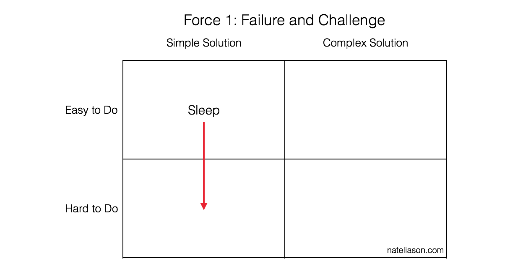
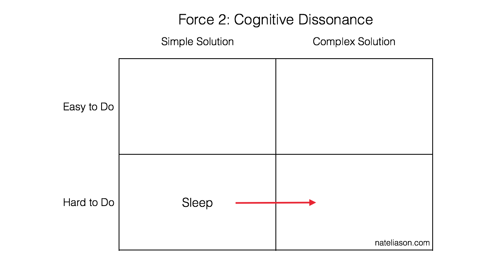
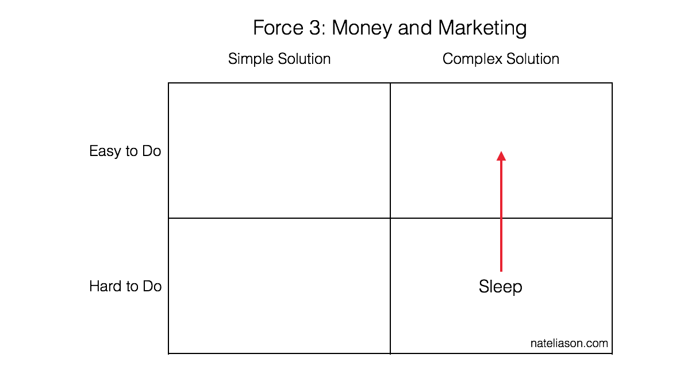
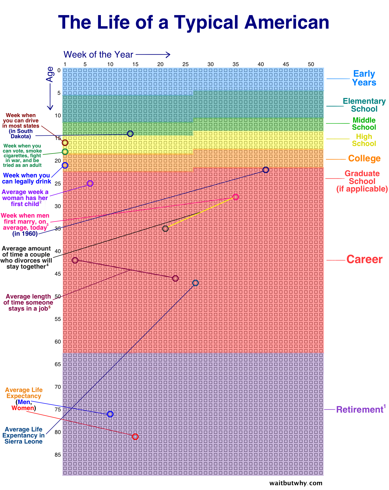
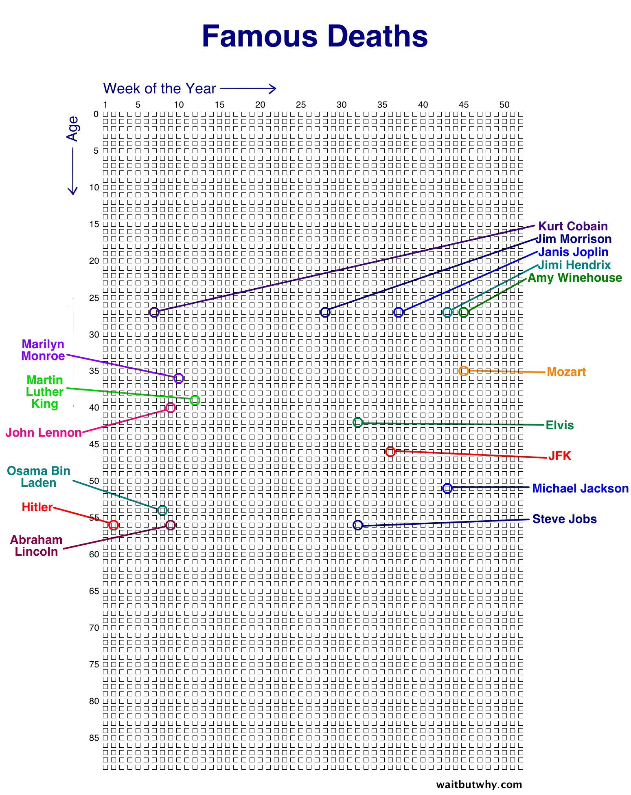
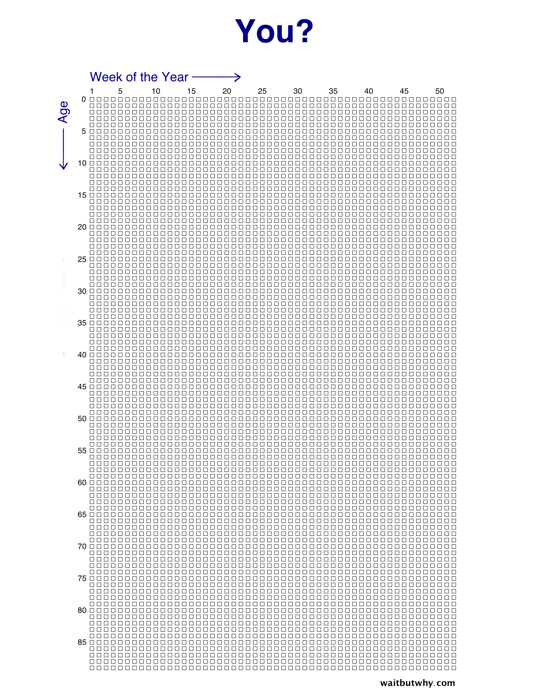

> **Simple** here means straightforward and containing few steps or moving pieces
**Easy **here means requiring little effort or willpower to follow through on.

**The Law of Artificial Complexity**: As the number of people experiencing a problem increases, so will the artificial complexity of the solution.
  **The Law of Decomplication**: The more people that are experiencing a problem, the simpler the solution should be.
> Embedded: bookmark
> We should aim for **simplicity** because simplicity is a prerequisite for **reliability**.

**Simple is often erroneously mistaken for easy**. "Easy" means "to be at hand", "to be approachable". "Simple" is the opposite of "complex" which means "being intertwined", "being tied together". Simple != easy.
  Build simple systems by:
  - Abstracting - design by answering questions related to what, who, when, where, why, and how.
  - Choosing constructs that generate simple artifacts.
  - Simplify by encapsulation.

> ***“How can you achieve your 10 year plan in the next 6 months?” —*** Peter Thiel**
*“Until we can manage time, we can manage nothing else.” —** Peter Drucker
**“Nothing will fill your heart with a greater sense of regret than lying on your deathbed knowing that you did not live your life and do your dreams.”  ***— Robin Sharma

When you start acting in accordance with your intuition, you develop confidence. Conversely, acting against your intuition can often produce short-term dopamine, and a long-term lack of confidence.
> **Living in the same place as the people you love matters**. I probably have 10X the time left with the people who live in my city as I do with the people who live somewhere else.

**Priorities matter**. Your remaining face time with any person depends largely on where that person falls on your list of life priorities. Make sure this list is set by you—not by unconscious inertia.

**Quality time matters**. If you’re in your last 10% of time with someone you love, keep that fact in the front of your mind when you’re with them and treat that time as what it actually is: precious.
**It turns out that when I graduated from high school, I had already used up 93% of my in-person parent time. I’m now enjoying the last 5% of that time. We’re in the tail end.**

> 有时候我们之所以痛苦，是因为我们认同一个观念，却又在做着与之相反的事。这种时候要么需要改变我们所做的事情，要么需要更新我们的观念。
> Embedded: bookmark
> “二十五岁已死，七十五岁才埋” 这是常见的人生悲剧。

许多不高尚的痛苦，来自你的主角情结。**你没那么重要，你的痛苦也没那么重要，“为什么没人搭理我？”这不是痛苦的原因，而是结果。**
  **一个多数人回答不上来的问题
**这个问题就是：**如果所需一切条件都予以满足，你最想做的事情是什么？
什么是自己不想要的？什么是自己想要的？这完全是两个问题，难度系数有天壤之别。**

> An **antifragile** way of life is all about finding a way to gain from the **inevitable disorder** of life. To not only bounce back when things don’t go as planned, but to get stronger, smarter, and better at continuing as a result of running into this disorder.

**Goals and habits, as they are represented in mainstream culture, are very fragile things.**
some principles that come from Antifragile:
  1. Stick to simple rules
  2. Build in redundancy and layers (no single point of failure)
  3. …

Seven modes (for seven heads)
Here are seven modes that I think capture a good chunk of my own day to day states.
  1. **Recovery Mode …**
  2. **Novelty Mode …**
  3. …
  If you’re feeling stuck, switch modes. Try another head.

Being a Hydra is all about the **long term
**The 1st day of every month is your chance to re-start, revise, and recommit to the things that are most important to you.
> **But I always want it to be a project that, if successful, will make the rest of my career look like a footnote.
**One of the notable aspects of compound growth is that the **furthest out years are the most important

“I will fail many times, and I will be really right once” **is the entrepreneurs’ way. You have to give yourself a lot of chances to get lucky.
**
**Look for **small bets** you can make where you lose 1x if you’re wrong but make 100x if it works. Then make a bigger bet in that direction.

You can get to about the 90th percentile in your field by working either **smart** or **hard**, which is still a great accomplishment. But getting to the 99th percentile requires **both.**
> Unless you learn to **face your fear** you will never achieve anything. Fear of failure, fear of rejection, fear of shame. These are the things that get in between us and our potential.

**Asking for help** is a form of vulnerability. That's why people tend not to do it, they're afraid of displaying a lack of strength. But really, vulnerability is an incredible strength.

**Happiness conditional on external factors will always be unobtainable**. The same thing goes for validation and safety. Money will not make you feel safe; nothing will. There is no safety in the face of your own mortality.
> To get what you want, **deserve what you want**. Trust, success, and admiration are earned.

Learn to think through problems [backwards](https://www.farnamstreetblog.com/2014/07/charlie-munger-thinking-backward-forward/) as well as forward.

Attain fluency on [the big multidisciplinary ideas](https://www.farnamstreetblog.com/mental-models/) of the world and use them regularly.

Use setbacks in life as an opportunity to become a bigger and better person. Don’t wallow.
> Embedded: bookmark
> **Motivation** isn’t something you have, motivation is something you get, automatically, from feeling good about achieving small successes.

In essence, **discipline** produces **action** which leads to a more **sustainable** form of motivation.

When we're procrastinating we're in a state of rest - motivation doesn't start the ball rolling. Only action can act as the "external unbalanced force" to push us into a state of motion. Once moving, a **feedback loop **develops and it becomes harder to stop because the desire to complete tasks provides the drive necessary to continue moving forward.
> Embedded: bookmark

> Embedded: bookmark
> If I had to put the recipe for genius into one sentence, that might be it: to have a **disinterested obsession** with something that matters.
An obsessive interest in a topic is both **a proxy for ability** and **a substitute for determination**.
The disinterestedness of this kind of obsession is its most important feature. Not just because it's a filter for earnestness, but because it helps you discover new ideas.
> Embedded: bookmark
> If the company is default alive, we can talk about ambitious new things they could do. If it's default dead, we probably need to talk about how to save it.
> Embedded: bookmark
> I think what religion and politics have in common is that they become part of people's identity, and people can never have a fruitful argument about something that's part of their identity.

**The more labels you have for yourself, the dumber they make you.
**If people can't think clearly about anything that has become part of their identity, then all other things being equal, the best plan is to let as few things into your identity as possible.
> Embedded: bookmark
> **When experts are wrong, it's often because they're experts on an earlier version of the world.**
Most really good startup ideas look like bad ideas at first, and many of those look bad specifically because some change in the world just switched them from bad to good.

The first step is to have an **explicit belief in change**.
It seems to me that beliefs about the future are so rarely correct that they usually aren't worth the extra rigidity they impose, and that the best strategy is simply to be aggressively open-minded.

Another trick I've found to protect myself against obsolete beliefs is to focus initially on people rather than ideas.
**Surround yourself with the sort of people new ideas come from**. If you want to notice quickly when your beliefs become obsolete, you can't do better than to be friends with the people whose discoveries will make them so.

2022 videos, podcasts, quotes etc
