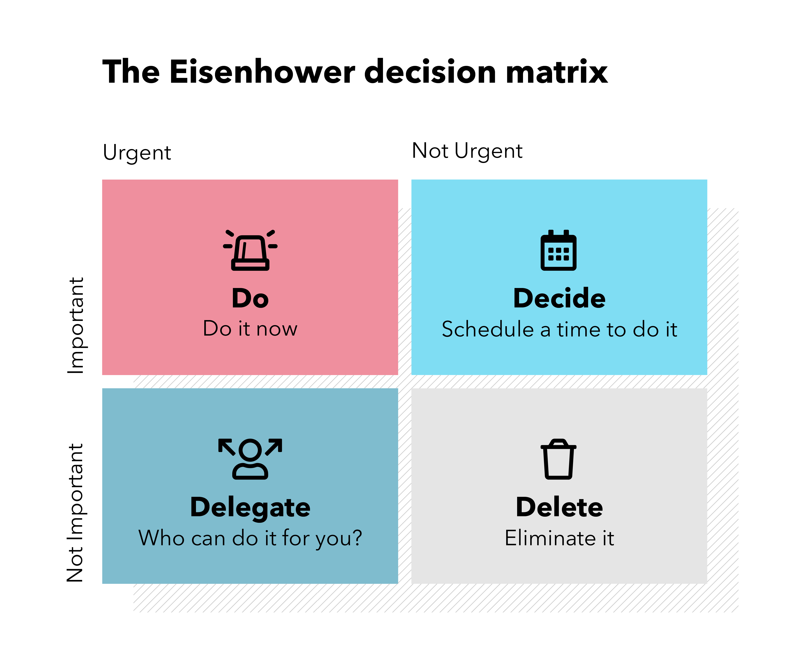
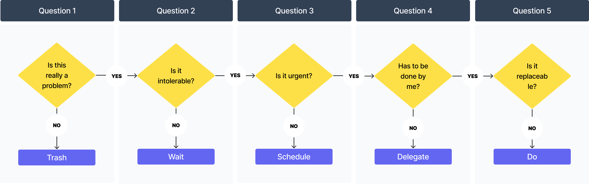

There’re many great mental tools for making decisions or solving problems. The decision matrix (a.k.a. the [Eisenhower Matrix](https://en.wikipedia.org/wiki/Time_management#The_Eisenhower_Method)) is one of them, if not the most popular one.

    There’re a ton of articles writing about it on the Internet, and it looks simple. But from my own experience, it is not an easy task for many people including me to distinguish the difference between urgency and importance. Otherwise there won’t be so many busy minds hurrying to getting more things done rather than focusing on stuff that actually moves the needle.

    To make real use out of it, there’s a hidden premise that better judgment needs to be developed, so that we can associate different tasks with the right matrix. And there’s no replacement for experiences and trial and errors when it comes to forming good judgement.

The way that works better for me is by **asking questions**, inspired by reading a [great article ](https://humanwhocodes.com/blog/2020/02/how-i-think-about-solving-problems/)from Nicholas C. Zakas. By going through a list of 5 questions in order, it gives me better mental clarity on what actions to take based on what type of problem I’m dealing with.

Here are the 5 questions that I extracted from the article, listed in the right order
`details`
#### Is this really a problem?  (i.e. consequential or not)
  > I’ll define a problem as anything that leads to an objectively undesirable outcome if not addressed

**When in a leadership role, it’s common to receive complaints that sound like problems but are just opinions
**I ask these software engineers this question: is it a problem or is it just different? In many cases “wrong” just means “not what I’m used to or prefer.” If you can identify that a reported problem is not, in fact, a problem, then you no longer need to spend resources on a solution

`details`
#### Does the problem need to be solved?  (i.e. tolerable or not)
  > A problem doesn’t need to be solved if the undesirable outcome is tolerable and either constant or slow growing
Another way to ask this question is, “what happens if the problem is never solved?” If the answer is, “not much,” then it might be okay to not solve the problem.

`details`
#### Does the problem need to be solved now?  (i.e. urgent or not)
  > Some problems are obviously urgent and need to be addressed immediately: the site is down, the application crashes whenever someone uses it, and so on

Technical debt is any part of your application (or related infrastructure) that is not performing as well as it should. It’s something that will not cause a significant problem today or tomorrow, but it will eventually. **In my experience, tech debt is rarely addressed until it becomes an emergency (which is too late)**. However, tech debt isn’t something that everything else should be dropped to address. It falls into that middle area where it shouldn’t be done today but definitely needs to get done.

`details`
#### Does the problem need to be solved by me?  (i.e. assignable or not)
  > “is this a Nicholas problem?” **There were certain things only I knew how to do and those were the things I should be focusing. Anything else should be delegated to someone else. **Another important tip he gave me: **just because you can do something faster than someone else doesn’t mean you should do it yourself.** For most non-urgent tasks, it doesn’t matter if it is completed in one day or two.

`details`
#### Is there an easier problem I can solve instead?  (i.e. replaceable or not)
  > The key is that the easier problem must give you the same or a similar outcome to the original problem while saving time (or other resources).

Sometimes, I find flow charts more straightforward than words, therefore I created one for the sake of it.

The questions are phrased in a hierarchy with previous ones as preconditions. It structures our thinking through synthesizing situation at hand. It also sparks insights that lead to better understanding about the problem.

Every step of questioning is a great filter, when applied properly, that will cut the clutter to uncover the essence. It’s a great mental framework that simplifies our decision making without drowning us into the nitty gritty details.

One thing it has in common with other decision making tool is that **it separates the need to think and decide from the actual action to take**. This is a benefit that often gets under-appreciated.

Nowadays we’re surrounded by flood of information from a myriad of interruptions pipes. Bundled with the fear of missing out, we’re more prone to subordinate to impulsive reactions rather than thoughtful responses. Without surprise, it only yields suboptimal decisions that accounts for suboptimal results.

Because thinking takes conscious effort, we choose to avoid thinking by default. There’re a lot of movements, but little progress. By mixing both thinking and action, we commit to neither of them. What we should do instead is to give thinking the right amount of attention it deserves, and take actions once we’ve thought things through. And asking questions is a good way to do that. In return, the mind gets calmer, and the decision gets better.

Give it a try and see if it works for you as well.
