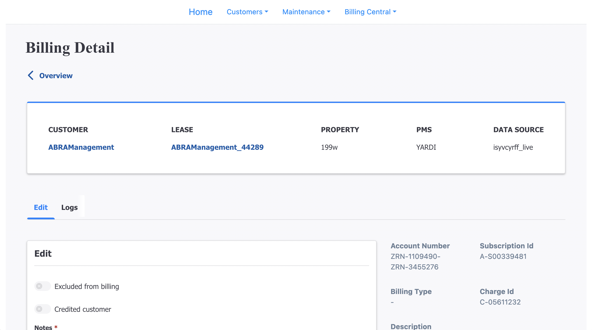
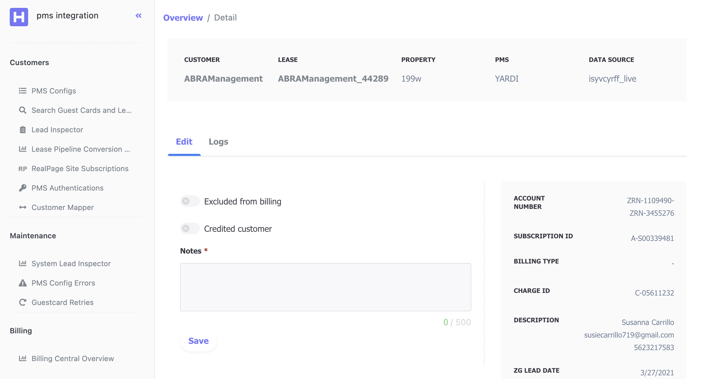

If you start finding yourself constantly getting down the rabbit hole of fighting with the tool to try to build something, it might be a good time to take a step back and reflect if you are using the right tool.

Cognitive load matters. Human brain has its own limit especially when working with tasks that demands attention. The more energy drained into getting the tool to give what you want, the fewer will be left for us to focus on other important aspects, e.g. polishing things up or coming up with nice touches, and those are usually what matters.
## A website example
When working with websites, the goal is to make things look alright. It should be turning a “mock” into a program. Tools are there for helping with the translation process rather than creating obstacles. And I have found that atomic css works better for me than certain css-in-js library.

> *Atomic CSS is the approach to CSS architecture that favors small, single-purpose classes with names based on visual function*

Style needs tweaking. Unless you are a true expert, most of us start from inspecting style rules (css) in browsers with a lot of “guesswork” plus “googling” to get things look fine. No matter how good component (e.g. react) props resembles css rules they are still one level of abstraction sits on top of *standard* css. And you don't have the same live editing experience when working with components compared to making changes in browser on the fly, hot reloading is cool but it is not nearly as reliable. However, I am not gonna focus on analyzing on the tradeoffs of css-in-js, there are a ton of articles online already and I am surely not an expert on the topic, I will pick one aspect that is not mentioned quite often, which is many css-in-js libraries are usually unnecessarily verbose.

Let us compare:

```xml
`<Box borderWidth={1}>`
  `<Spacer margin={4}>`
    `<Flex display="flex">`
      `<Text size="sm">`
      `<Text>`
    `<Flex>`
  `<Spacer>`
`<Box>`
```

vs

```html
<div class="border m-4 flex text-sm"></div>
```

In fact they are semantically similar, but the former results a hierarchy of nested component only for styling purpose while the latter is simply a div with all the classes. Component hierarchy does nothing help for editing or debugging experience. Consider every update of styles, you need to wrap/unwrap existing component with other components against simply append/remove classes. The difference between amount of effort could be trivial only if you don’t  need to tweak the styles often to get it look alright. Things adds up quickly.
### Conclusion





With less time spend on thinking about **how** to work with the css in js library in an idiomatic way and more time on **what** the UI should look like (and only use the tool as a mean to achieve it) instead, we get a broader picture when building products. I would not say picture on the right is much better than the one on the left, both sucks more or less. But it is clear that the right handed one has taken more design thoughts into it, which is gained by spending less time fighting with the tool.
