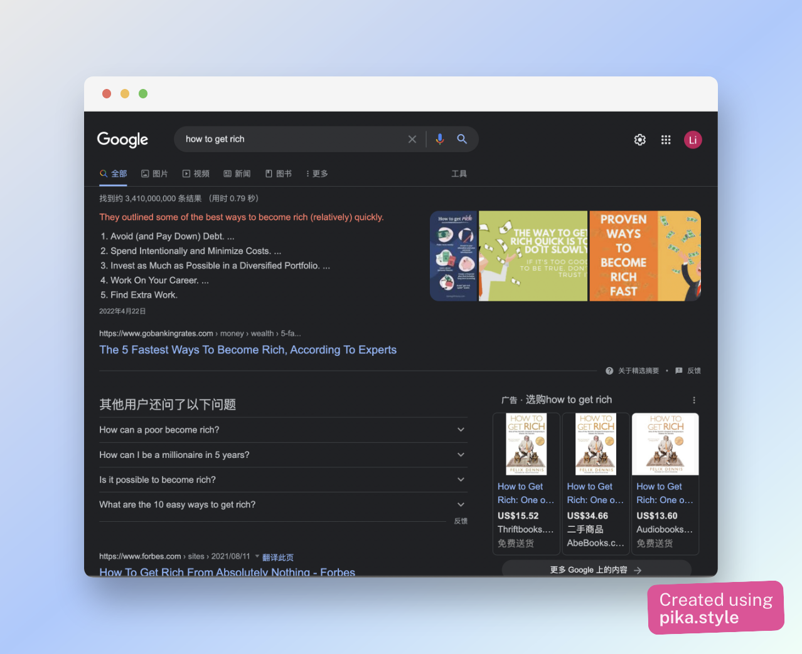
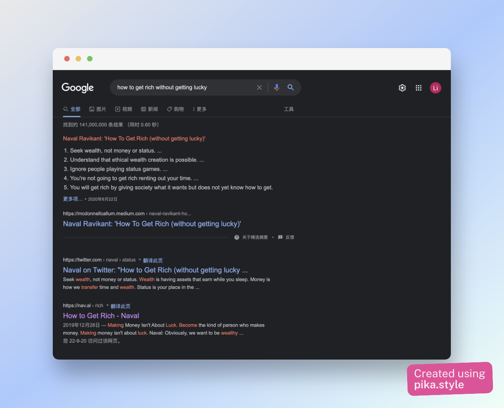

I used to like helping new team members with their onboarding process, partly because I've gone through the same thing before, so I know some of the pain points that they’re likely to encounter.  In addition to that, it's also a good chance to have a fresh eye to spot some ["broken windows"](https://en.wikipedia.org/wiki/Broken_windows_theory) of the team that have long been ignored.

Guess I don’t consider my enthusiasm as a bad thing, at least not until I became the designated mentor of interns three times in a row in my [last job](./my-pip-experience.md).

Learn from the past experience, I decide to make some adjustments to my work routines. More specifically, I choose to engage less with instant messages or emails. **Instead of replying "now", I default to replying "later"**.

But how about all those annoying notifications that create the false sense of urgencies? Well, there's a setting on Mac called 'Do Not Disturb' mode for this. And my change turns out to be just fine.

Recently my team get some new joiners again. I wasn't assigned as their onboarding buddy, so I have the chance to observe a bit more. As expected, there're new questions about onboarding or development machine setup in the team's Slack channel. But this time, instead of trying to be the first one to reply, I’ll usually notice the questions only after they have been posted and addressed since I’ve my notifications turned off.

There're actually very few questions need my presence at all, consider I am not the most senior person in the team anyway. Although my disengagement doesn't seem to cause any obvious downside for me, it does come with some upsides.

First, It ensures diligent research have been done. Better question leads to better answers while bad question just creates endless rabbit holes. Compare the following search result

Modern search engines are insanely powerful that it’s literally impossible to not have answers for questions that are stated correctly. That being said, the quality of question does matter a lot, [How To Ask Questions The Smart Way](https://github.com/selfteaching/How-To-Ask-Questions-The-Smart-Way) has detailed guidance on this.

Sometimes we post our question *too fast* that we find the answer almost immediately after asking publicly. I personally made this mistake a couple times before and I always end up regretting about my rush. A lot of times it's simply caused by not reading the wiki or documentation carefully, or by not bothering to proofread what we're really asking about (but expect others to understand and answer it).

Also, it matches the right supply with the demand. You *aren’t alone* in wanting to help others. If you happen to work in a team with toxic culture that no one is willing to help, looking for a better environment might be a more rational choice than attempting to fix it all by yourself.

But quite often, there will be someone with appropriate domain knowledge happily stand up and teach. The result of this is that it avoids unnecessary context switching for you and you get more blocks of uninterrupted time for free. The cost of context switching can hardly be over emphasized for certain intellectual tasks (e.g. debugging subtle bugs without deterministic reproductions) that heavily tax the brain, Paul Graham also mentioned about this in his popular article [Manager Schedule, Maker Schedule](http://www.paulgraham.com/makersschedule.html).

Last but not least, It doesn’t really make you unhelpful. In fact,** it merely eliminates the need to “show off” how helpful you are**. If a well phrased question has been raised and doesn’t have an answer for an hour or two, you can always chime in and you have enough time to prepare for a well phrased answer as well. Good question tends to get good answer, it’s that simple.

In the end, you'll enjoy the fact that it rarely hurts to be a bit more **patient** than the busy and noisy world wants you to be.
