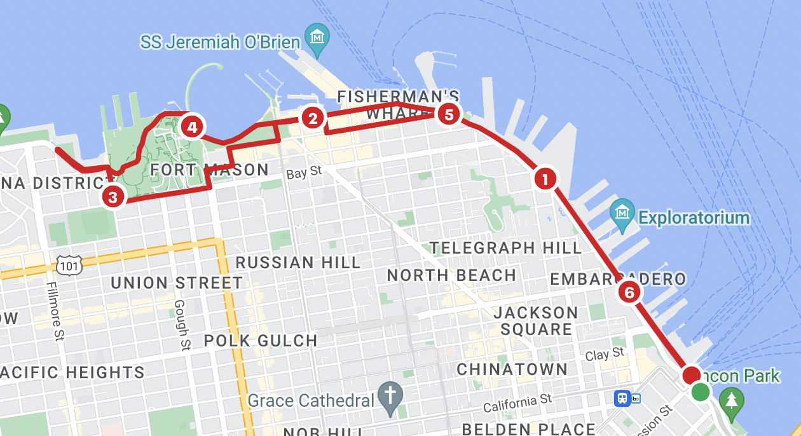
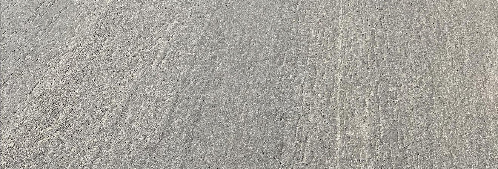

I used to hate running on hilly roads and I'll try to bypass it whenever possible. It's physically taxing and it reminds me of the law of physics that I especially want to escape from during a run. But living in a hilly city (the 2nd hilliest in world) like [San Francisco](/fd053c056d7e492f96bfd2b839de28dd) makes it really hard and sometimes impossible to avoid them. You'll know what I mean if you've ever visited the Chinatown area in SF, and thank God it doesn't snow here like the north east coast usually does during the winters.

I recently participated in a [local 10k race](./sf-10k-race.md) event and the route has some hills to climb. Noticeably the one in the picture below.

It won’t be anything intimidating for a seasoned runner, but it’s steep enough to scare away rookies like me. I've practiced running on it for a few times only to realize and it never fails to exhaust my energy both mentally and physically. The glamorous view on top of the hill only makes things worse. Dense trees surrounded by groups of people hanging around with each other under the shades. This is what a destination looks like. It fuels imaginations and sparks cravings, but it doesn't make anything right in front of me easier if not harder. As stats won't lie, I slowed down significantly during the splits of route that covering the hills. The more energy I spent on uphill climbing, the longer the downhill recovery became as well.

Obviously, there’re strategies to apply when dealing with hills in a race for better results, and there’re a ton of online [resources](https://runnersconnect.net/hill-running-form/) offering technical solutions for it which I’m also interested in learning. However, there’s a simple hack that I recently found and it has changed everything for me since. It’s so simple that we barely notice it.

**Just keep your heads down. **

No grass, no trees, no groups of people hanging around with each other, nothing fancy besides a flatten road. As dull as it looks, there's not much to be excited about, as well as not much to be afraid of. By simply letting the body and feel drives the move, it magically creates a steady rhythm for you. It's like that you’ve temporarily forgot about the pull of gravity and the earth becomes a flatten earth as if there’s no hill at all. Instead of hearing the sound of the surroundings, your deep breath and fast beating heart will draw your full attention and vividly remind you about the feeling of being alive and the necessity of embracing the moment. It's in fact when we’re constantly fantasizing about the future or rushing to an end that we get distracted and lost touch with our present body and mind. While keeping our heads down brings us back to the presence. We can only move forward one stride at a time and we’re fully in control of getting the current stride right.

Of course, there're a lot of times when keeping the [heads up](/91cc1f46c2dc41a29b1461372606e136) during a run is important, just not when you’re dealing with a hill like this. Maybe I’ll find it the other day.
