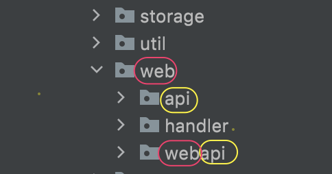

> The beginning of wisdom is to call things by their proper name
*- Confucius*

Disambiguation
- Page endpoint: [Endpoint](https://en.wikipedia.org/wiki/Web_API#Endpoints) serving `html` HTTP response
- API endpoint: [Endpoint](https://en.wikipedia.org/wiki/Web_API#Endpoints) serving `json/xml/html partial` HTTP response

[Directory structure](https://en.wikipedia.org/wiki/Directory_structure) similar to [tab vs space](https://kennethreilly.medium.com/tabs-vs-spaces-3c24defa7c9e) is an "unsolvable problem". It always raises incessant debates that emphasize personal preferences while neglecting about **what's the problem to solve**. In general, there're 2 popular ways of doing this, i.e. grouping by file types (functionality) or grouping by features. Or if you embrace minimalism, a [single index.php](https://www.reddit.com/r/PHPhelp/comments/kvr5w2/a_singlefile_php_web_application_is_it_crazy/) can be a reasonable choice as well.

In fact, what's more important might be how you decide to name stuff. Naming is hard, probably the [hardest thing](https://www.martinfowler.com/bliki/TwoHardThings.html) in software engineering. I get confused when seeing directory structure like this.

I have no question about `storage` or `util` since they fall under the “grouping by file types” category, but everything under the `web/**` isn't as clear as above. There're 3 terms "web", "api" and "handler" each may have very different meaning under different context. In combining "web" with "handler", I got ["web handler"](https://docs.spring.io/spring-framework/docs/current/javadoc-api/org/springframework/web/server/WebHandler.html) (a.k.a "controllers") which is self explanatory. But how about "web api" ([Web API](https://en.wikipedia.org/wiki/Web_API)??) and "web webapi"?

After working with the codebase for a while, I eventually figure out that all stuffs within the web folder are web handlers for different purposes. i.e. `web/handler` is for page endpoint, `web/api` for api endpoint, `web/webapi` for api endpoint **only** accessed by browser or mobile. It's clear that this isn't an **idiomatic** way of naming things and professionals can do better than that. But how could it be named like this? Obviously there're some background stories.
  - One of them is migration. Migrating from monolithic web applications to [service-oriented architecture](https://en.wikipedia.org/wiki/Service-oriented_architecture) (data layer), as well as from [multiple page app](https://en.wikipedia.org/wiki/Dynamic_web_page) to [single page app](https://en.wikipedia.org/wiki/Single-page_application) (presentation layer) usually happens side by side, this is what's causing above [Page endpoints](./naming-is-hard-but-important.md) to be turned into a hybrid of Page and [API endpoints](./naming-is-hard-but-important.md).
  - Then there's the pressure of getting things done. Everyone knows that business values velocity, and it's not a bad thing. Especially for tasks with little to none return of investment like migration, the rush to get it done and move into the next more interesting stuff is very tentative (I'm in the same group 😅). However, if we can zoom out a bit and evaluate the cost of time wasted to understand and maintain code full of arbitrary names, we might be willing to put a few extra minutes going through list like [this](https://www.baeldung.com/cs/clean-coding-naming) and come up with more thoughtful names instead
  - Also, people tend to assume others understand their assumptions. It’s a common cognitive bias called [curse of knowledge](https://en.wikipedia.org/wiki/Curse_of_knowledge). E.g. in naming the folder as "web/webapi", there is an assumption that the API is browser/mobile facing is a shared consensus, while I can't see why the same thing can't be applied to "web/api" either. Simple changes like below will help clarify this a lot

```plain text
├── handlers
    ├── page
    ├── api
    │   ├── protected
```

You might ask "what would be the idiomatic way of doing this then?" Let's turn to the community for some inspiration, since it's usually smart not to reinvent the wheel unless for "good" reason. Use two [convention over configuration](https://en.wikipedia.org/wiki/Convention_over_configuration) web frameworks as example.
  
The [Rails (Ruby)](https://guides.rubyonrails.org/getting_started.html) skeleton:

```plain text
├── Gemfile
├── Gemfile.lock
├── README.md
├── Rakefile
├── app
    ├── assets
    │   ├── config
    │   ├── images
    │   └── stylesheets
    ├── channels
    │   └── application_cable
    ├── controllers
    │   ├── application_controller.rb
    │   └── concerns
    ├── helpers
    │   └── application_helper.rb
    ├── javascript
    │   ├── channels
    │   └── packs
    ├── jobs
    │   └── application_job.rb
    ├── mailers
    │   └── application_mailer.rb
    ├── models
    │   ├── application_record.rb
    │   └── concerns
    └── views
        └── layouts
├── babel.config.js
├── bin
├── config
├── config.ru
├── db
├── lib
├── log
├── node_modules
├── package.json
├── postcss.config.js
├── public
├── storage
├── test
├── tmp
├── vendor
└── yarn.lock
```

The [Phoenix (Elixir)](https://www.phoenixframework.org/) skeleton:

```plain text
├── _build
├── assets
├── config
├── deps
├── lib
│   ├── hello
│   ├── hello.ex
│   ├── hello_web
        ├── controllers
        │   └── page_controller.ex
        ├── templates
        │   ├── layout
        │   │   ├── app.html.heex
        │   │   ├── live.html.heex
        │   │   └── root.html.heex
        │   └── page
        │       └── index.html.heex
        ├── views
        │   ├── error_helpers.ex
        │   ├── error_view.ex
        │   ├── layout_view.ex
        │   └── page_view.ex
        ├── endpoint.ex
        ├── gettext.ex
        ├── router.ex
        └── telemetry.ex
│   └── hello_web.ex
├── priv
└── test
```

Not to say they are the best practice to follow, but generic terms like "web" and "api" are either avoided or used with caution, plus we can always fallback to google for more detailed explanations thanks to their popularity.
