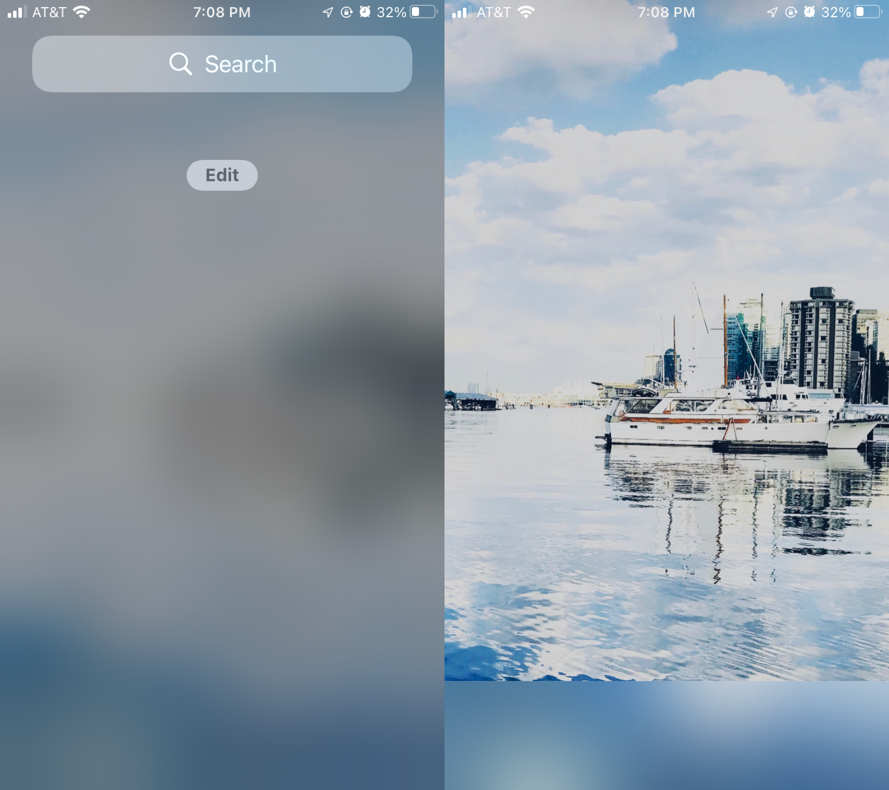
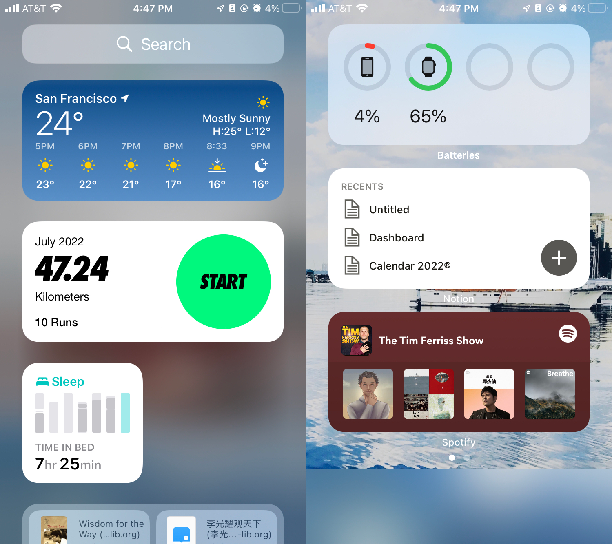

> Writer Adrienne Matei spends two hours and 20 minutes a day on her phone – which might seem fine, until you realize it amounts to 35 full days a year. [https://www.theguardian.com/lifeandstyle/2019/aug/21/cellphone-screen-time-average-habits](https://www.theguardian.com/lifeandstyle/2019/aug/21/cellphone-screen-time-average-habits)
## What
It’s a concept that I learned when reading a book called Digital Minimalism by professor Cal Newport who famously wrote lots of great articles and books about topics like productivity and [curating a deep life](https://www.calnewport.com/blog/2020/04/20/cultivating-a-deep-life/).

> A philosophy of tech use in which you focus your *online* time on a small number of carefully selected and optimized activities that strongly support things you value and then happily miss out on everything else

Digital minimalism, according to Cal’s definition, is a typical working backwards example that modern technology like internet and smartphone should be adapted to reflect things we value deeply rather than serving as a constant source of distractions.

Hence, digital declutter is a “radical” process proposed by Cal to redefine how we interact with those digital products and embrace a digital minimalism lifestyle at heart.
## Why
Generally, under today’s attention economy, our attention and mind are constantly being “hijacked” by flooding news and social medias designed for business merits while ignoring human brain’s processing limit. As a result of information overload, mental issues like stress, anxiety and fear of missing out etc are becoming increasingly popular among the younger generations. Companies come up with different techniques like Personalization, Recommendations algorithms in response to the problem, only leading to new issues like information cocoons and filtering.

Aside from it, not until recent years did I start to realize how much of my own time is “killed” by mindless activities like surfing the internet, watching news and seeking social proofs on social medias. Those gradually formed digital habits are so hard to recognize as we’re surrounded by people sharing the similar habits, e.g. sitting on a subway starring at the phone with short videos tailored to our specific interests playing for hours.

Fortunately, books like Hooked and the Netflix documentary film [**The Social Dilemma**](https://www.netflix.com/title/81254224) became the wake-up call for me. As an engineer, I understand that to be able to solve meaningful problems, the ability to work deeply is crucial and deep work requires cultivating long attention spans. As James Clear the author of Atomic Habits points out, one way to break a bad habit is to replace it with a new one, so I decided to give the digital declutter process a try.
## How
The book originally proposed a 30-days digital decluttering with our smartphone starting from a clean state(all apps uninstalled). As Cal points out, it’s intended to be “radical” as more lenient approaches don’t work well. But I personally found that 30 days plus uninstalling all apps may create too many barriers for me to even get started. So I tweaked it a bit to suit my situation better. More specifically, the steps are

1. Do a one-week version of it, rather than 30 days, reflect and refine from there
2. Remove all the Apps (or Widget) from home screens, w/o uninstalling them so that I can keep notifications from work etc
3. Only add Apps back to home screen after a simple reason being recorded in Notion

There’re some prep work to be done so that our sudden change won’t affect others close to us and It should not affect important work related schedules. But overall, it’s graceful enough for a one-week experiment.
## Result
### Home Screen

    Before {color="gray_bg"}

    After  {color="gray_bg"}

### Screen Time

    Before (day) {color="gray_bg"}
    Screen Time: 121m
    Pick Ups: 30

    After (day) {color="gray_bg"}
    Screen Time: 59m (↓ 51%)
    Pick Ups: 23 (↓ 23%)

*(According to stats from RescueTime iOS app, users of the app spend 3h20m/day on average on their smartphone)*

| App | Reason |
| --- | --- |
| Notion | Daily journaling app used for recording this progress and organizing thoughts, projects etc. |
| Screen Time | The app used for measuring progress in this digital declutter process |
| Spotify | Podcast & music while running, walking |
| Nike Run Club | Monitor running progress |
| Weather | Checking weather for workout, outdoor activities |
| Sleep Time | Monitor my sleep schedules |
| Mail | Emails |
| Kindle | Reading when leisure |
| Files | SF MOMA eticket |
| Principles In Action | Learn about Ray Dalio’s Principles |
