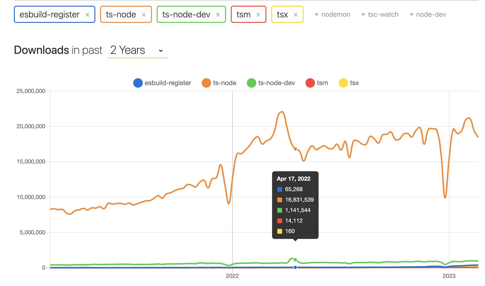

Ever need to run a TypeScript (TS) entry file from command line directly? There’re many tools for that, in fact, probably too many to find the one that *just works.*

The real problem is that the requirement varies case by case, it’s a no-brainer if you only have a single TS to run against, an IDE plugin is capable of doing the inline evaluation trick, but how about running against a TS file that meets the following conditions?
1. It’s within a TS project (with `tsconfig.json`)
2. It depends on a mix of ES modules (ESM) & CommonJS modules (CJS) (e.g. importing libraries / `node_modules` distributed in different format)
3. It doesn’t use the modern ESM import specifier (i.e. with file extensions)
## Problem
Transitioning from CJS to ESM is a pain in the ass, anyone who has done similar migration know what I mean (compare it to Python 2to3). Just to elaborate a bit
- ESM is backward compatible with CJS, but not vice versa. That’s to use ESM in CJS files, you can only use dynamic import `import()` , which is impossible without significant refactoring
- ESM has the thing called [Mandatory file extension](https://nodejs.org/api/esm.html#mandatory-file-extensions) which isn’t compatible with how most [existing](https://github.com/microsoft/TypeScript/issues/42151) TS codebase is written.
  ```javascript
import ... from './foo'    // ❌ how most apps were written
import ... from './foo.js' // ✅
  ```
- Existing tools have their own workarounds long before the standards arrival. Notably popular bundlers like Webpack 2+, Rollup etc are relying on non-official `module` field instead of `type` field in package.json to infer ESM during build phase.
- And more 🫱 [Why CommonJS and ES Modules Can’t Get Along](https://redfin.engineering/node-modules-at-war-why-commonjs-and-es-modules-cant-get-along-9617135eeca1)
## Common Solution
The most common solution is ts-node per google’s search result, better illustrated by [npm trend](https://npmtrends.com/esbuild-register-vs-ts-node-vs-ts-node-dev-vs-tsm-vs-tsx).

It solves condition #1 above, but left #2, #3 to me still. Because the incompatibility issue I mentioned above, I’ve tried to
- set `"type": "module"` in package.json
- rename file extension to `.mjs`

However, **every change only leads to a new problem**. To avoid going down the rabbit hole, I turned to other solutions.
## Solid Alternatives
> Embedded: external_object_instance
`npx tsx file.ts`
After a bit digging around I came across tsx which nailed the problem. It’s a run time based on esbuild known for its build perf compare to other node-native build tools. It’s zero config, that’s you don’t even need a `tsconfig.json` to start using it. One of its biggest selling point to my use case is

> It seamlessly adapts between CommonJS and ESM package types by detecting how modules are loaded (`require()` or `import`) to determine how to compile them. It even adds support for `require()`ing ESM modules from CommonJS so you don't have to worry about your dependencies as the ecosystem migrates to ESM.

That’s we don’t have do deal with the fragmented module system issue mentioned above, which is arguably the most painful thing to resolve **if you simply want to run some scripts.**

> Embedded: external_object_instance
`node -r esbuild-register file.ts`
Another tool worth mentioning is esbuild-register.
Similar to tsx, it’s a thin wrapper around esbuild. Like babel-register that transpiles ES on the fly using babel, it transpiles TS on the fly using esbuild. Because of that, it shares the same [gotcha](https://esbuild.github.io/content-types/#tsconfig-json) as esbuild, but nevertheless a great option if your project has esbuild in place already.
It’s not as out-of-box as tsx. But I’ve used it at work, and it easily scales to a Yarn Monorepo with 100+ [Workspaces](https://yarnpkg.com/features/workspaces/), which is fairly impressive and aligns well with the trend of front-end moving towards Rust / Go written build tools.

The author of the tsx package has done a more comprehensive comparison between various TS runners. I haven’t used most of them and may not need them for my use case, but they serve as options out there.
> Embedded: external_object_instance
## Summary
To recap, if your use case is simple enough that can be generalized, go with **ts-node** thanks to its full fledged features due to wide usage, but if your use case is more advanced that involves dealing with a legacy codebase, **tsx** is a better option that addresses the need well and deserves more attention.

Last but not least, what if the code is written in JS instead of TS, but with the same issue of transitioning from CJS to ESM? Consider giving [esm](https://github.com/standard-things/esm)  and [babel-node](https://iamturns.com/typescript-babel/) a shot.

---
## Related
- [HN thread](https://news.ycombinator.com/item?id=24067748) with some insightful discussions about CJS → ESM transition
