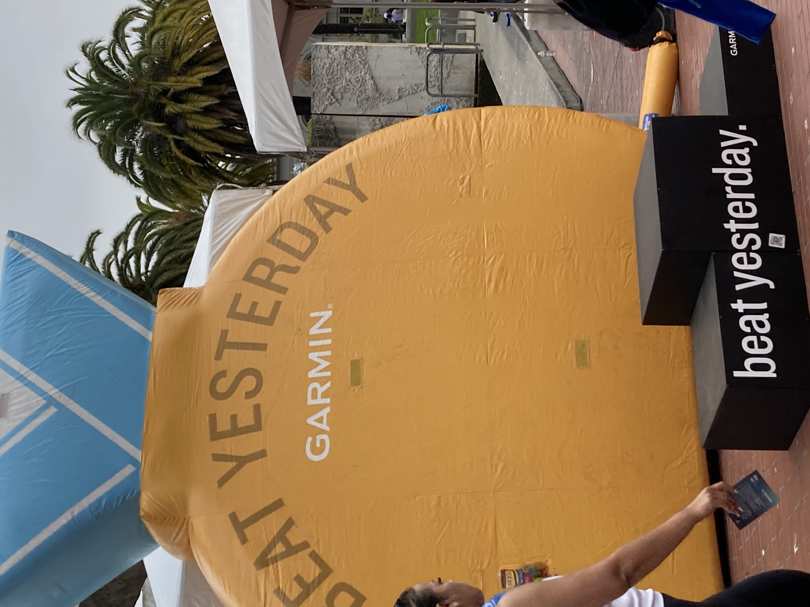
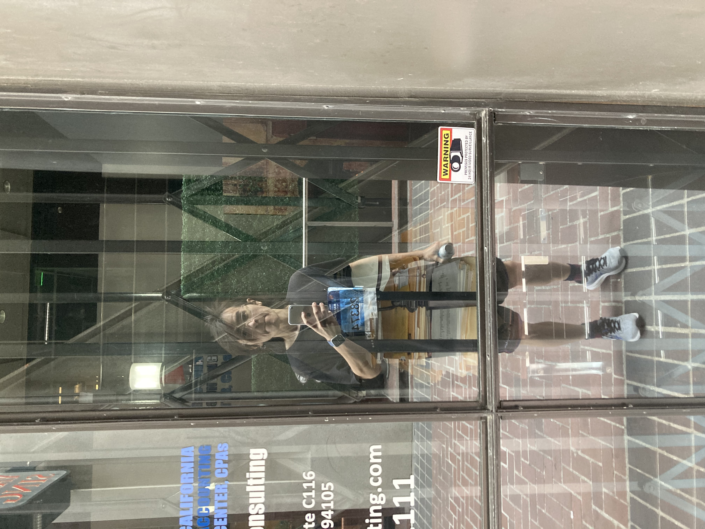
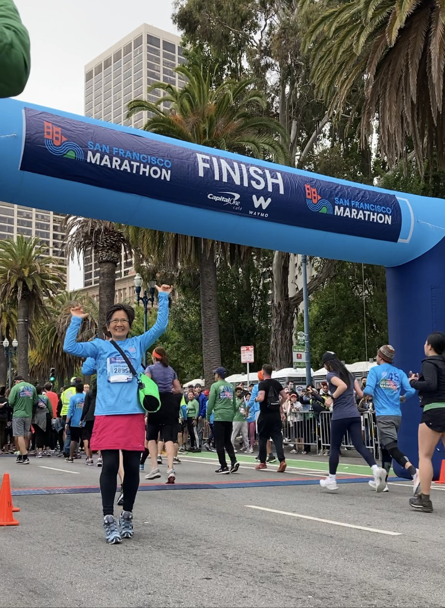
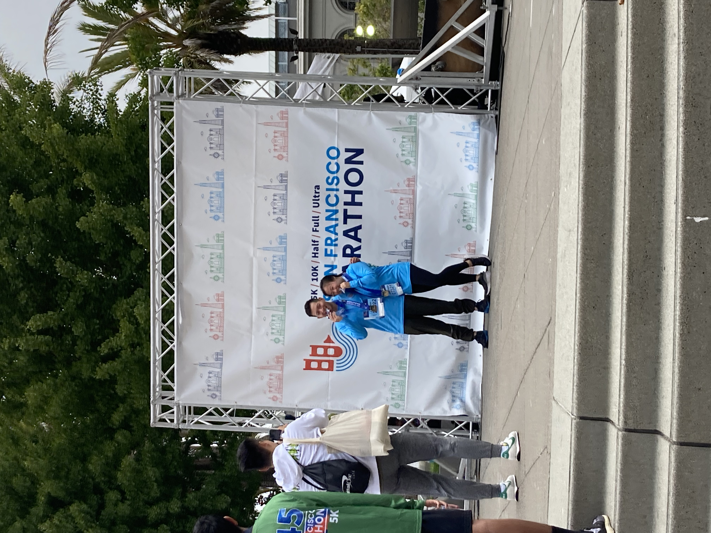

This is a post that records my first 10K race as part of my full marathon goal.

It’s part of my journey to rebuild myself, starting from replacing a few old habits with new ones, running is one of the habits that I built over the last year towards a healthier life. Although it was a struggle in the very beginning to make the new habit stick, it did become one of my daily rituals after a few months of grinding. And I cannot be happier with the changes it brought to me, I almost lost 20 pounds physically which makes me healthier than ever.

And more importantly, it strengthens my mind muscles to make me feel proud and confident about what I can achieve. I started setting more concrete goals for it to make the process a bit more fun and challenging, then the journey starts…
## Takeaways
- Peer pressure helps improve the result (i.e. speed)
- Don’t blindly follow the pace of others, but pick a right anchor helps
- **Hardest Mile: **6K \~ 8K
- Can speed up in the last mile **mentally**, but lack of nutrition or water **physically** stopped me from taking the risk
- Compete with personal best record not others, finishing together creates **deeper** satisfaction for me
## Event
- Result: [https://www.athlinks.com/event/1403/results/Event/1020821/Course/2266351/Bib/28374?source=internal](https://www.athlinks.com/event/1403/results/Event/1020821/Course/2266351/Bib/28374?source=internal)
- Detail: [https://www.thesfmarathon.com/2022-10k/](https://www.thesfmarathon.com/2022-10k/)
- Time: 2022-07-24 07:30
- Route & Map: [https://www.mapmyrun.com/routes/view/4559021239](https://www.mapmyrun.com/routes/view/4559021239)
  | Start | End |
| --- | --- |
| The Embarcadero near Mission Street | The Embarcadero near Market |
## Goals
- [x] Have Fun
- [x] Complete the race
- [x] Complete the race within 46m
## Background
- Initially seeking for local running club to join to run with peers but came across articles about SF Marathon
- I developed a morning running routine (a bit less than 5K) since last year as part of my unlearning journey
- I started setting weekly running goals since last month and I set the goal of this month to be 10K
- I estimated my 10K time between 45m \~ 50m, based on my current speed for 5K 6’50’’ \~ 7’30’’
## Timeline
- 2022-07-24 Finished SF Marathon 10K run with result of 44m (7’5’’)
- 2022-07-23 Participated SF Marathon 5K run
- 2022-07-17 Second 10K Run
- 2022-07-16 First 10K Run
- 2022-07-10 to 2022-07-16 Nike club plus daily 5K training plus weekend 10K training
  > Embedded: Embedded content unavailable
- 2022-07-10 SF Marathon 10K registration
## Medias
> Embedded: Embedded video

