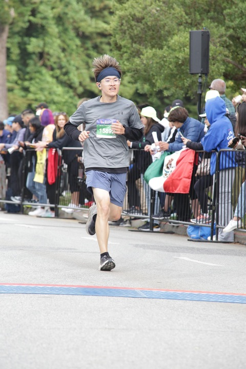
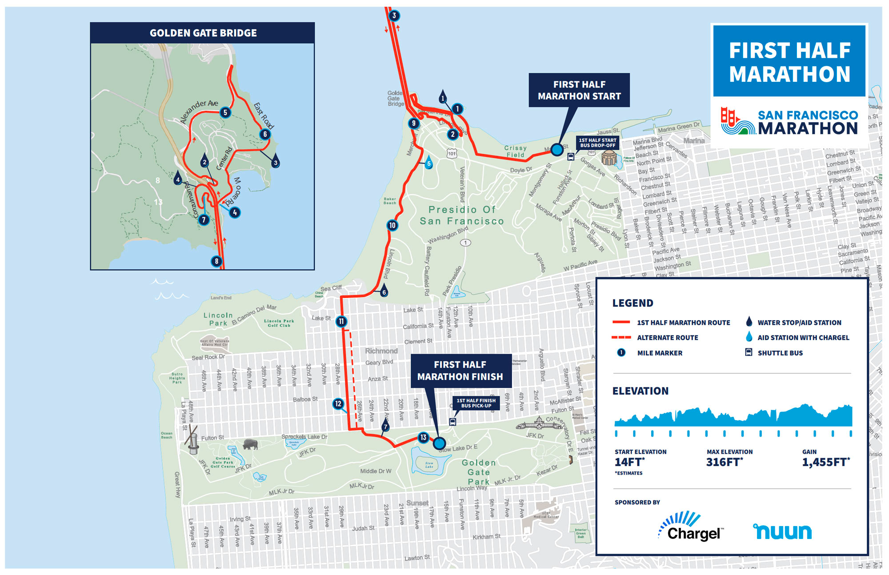
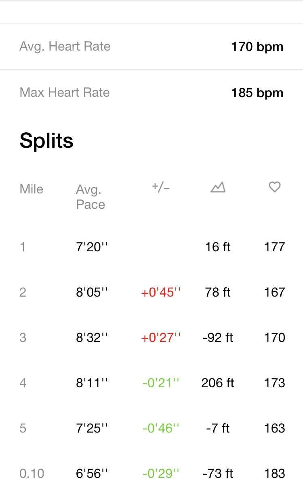

(follow-up post of [SF 10k race](./sf-10k-race.md))

> From the outside, they look like dramatic, almost revolutionary breakthroughs. But from the inside, they *feel* completely different, more like an organic development process - The Flywheel Effect

Momentum is a great thing. Once you get the flywheel spinning, there’s little you’ll have to do to keep it going. Despite relocating to Seattle, attending this event felt natural to me. It would have been harder to explain my absence than to participate.
### Preparation
Good result is all about preparation. One conscious decision I made this year is that I want to run faster but with less effort, in other word I want to run more **efficiently**. Through a random discovery process, I landed on a weekly routine which is a combo of a half marathon distance (to increase stamina) run and a tempo run (to improve strength).

I think I’m doing alright on this part. However, speaking of the race, I wasn’t well prepared as I lost a lot of time due to poor performance on hills and blocked by  crowds on the Golden Gate Bridge.
### Race is part of the process
> Forget about goals, focus on systems instead - James Clear

The more I run the more I’m orienting toward the process. I opted out the racing shirt (included as part of the registration fee) to plant a tree this year. Rather than wearing myself an environmentalist hat, I did this because I view them (including the race) as byproducts. The substance lies in the journey of self exploration. Last year’s 10k was unplanned but went way above my expectation, therefore I doubled down the distance this year.

Friends have asked me about how long have I prepared for the race. The answer is harder than it seems. A few weeks, months or maybe I’m always preparing? I don’t have a clear answer but I do trust in the process.
### I’m somewhere in the middle
Most participants can be classified into two buckets based on their goal of participation, entertainment or achievement. This is a simplified view but it tells a fact that everything is all about our **expectation**. For those runners who’re holding cameras while running crossing the Golden Gate Bridge, having fun and maximizing the social elements of the event is on top of their list. While those who’re heads down concentrating on their form, cadence and performance, they’re prioritizing getting the best result they could get.

I guess I’m somewhere in the middle, I’m effortful enough that I don’t have mental capacity for any leisure activity, but I’m not serious enough to hunt for a personal best.
### It’s not that much different
I actually ran both 5k and 10k last year besides I only registered (paid) for 10k. After finishing 5k, I was chatting with another runner who did a half marathon in SF the year before. He suggested me that I should participate a half or full marathon instead of 10k based on my performance on 5k, but I wasn’t sure if I was ready for that.

Looking back I think what he said was right, I was too conservative about what I was shooting for. Half marathon is a double distance of 10k, but double distance doesn’t mean it’s double as hard (the cost doubles ;)). If you can manage to finish 10k with a good pace, you’re ready for something much harder.

I’m always amazed by how much potential we human beings have and how blind we’re about it. We overestimate our competence at the expense of underestimating our potentials. How about full marathon then? Maybe it’s not that much different either, it could be both a meaningful and meaningless goal depends on how we see it. Just like more possessions don’t always bring more happiness, mindlessly ticking things off checklist is the same.
### It’s quite different
> No man ever steps in the same river twice, for it's not the same river and he's not the same man. - [**Heraclitus**](https://www.brainyquote.com/authors/heraclitus-quotes)

Every race is different and we’re different too. My focus has shifted from cultivating a  running routine that sticks to searching for better running techniques. The change happens organically and I never feel the rush.

I may also repeat what I was doing, running the same way same day. But not until I realize that repetition won’t lead to growth, only **iterations** will. The key to this realization is to establish a habit of embracing change.
### Wrap up
What a fantastic experience, stunning views, enthusiastic crowds, twists and turns of the race, and a lot more… I wasn’t doing perfect, and I probably never will, but that’s the meaning of race to me - to experience and to grow.

See you SF, until next time.

---
### Other information
Race Info
- **Name:** SF Half Marathon
- **Date:** Jul 23, 2023
- **Distance:** 13.1 miles
- **Location:** San Francisco, CA
- **Website:** [https://www.thesfmarathon.com](https://www.thesfmarathon.com)
- **Time:** [1:40:47](https://www.athlinks.com/event/1403/results/Event/1052040/Course/2367908/Bib/15892)

| Goal | Description       | Completed? |
| ---- | ----------------- | ---------- |
| A    | Enjoy enjoy enjoy | *Yes*      |
| C    | Don't mess it up  | *Yes*      |
| B    | PB                | *No*       |

