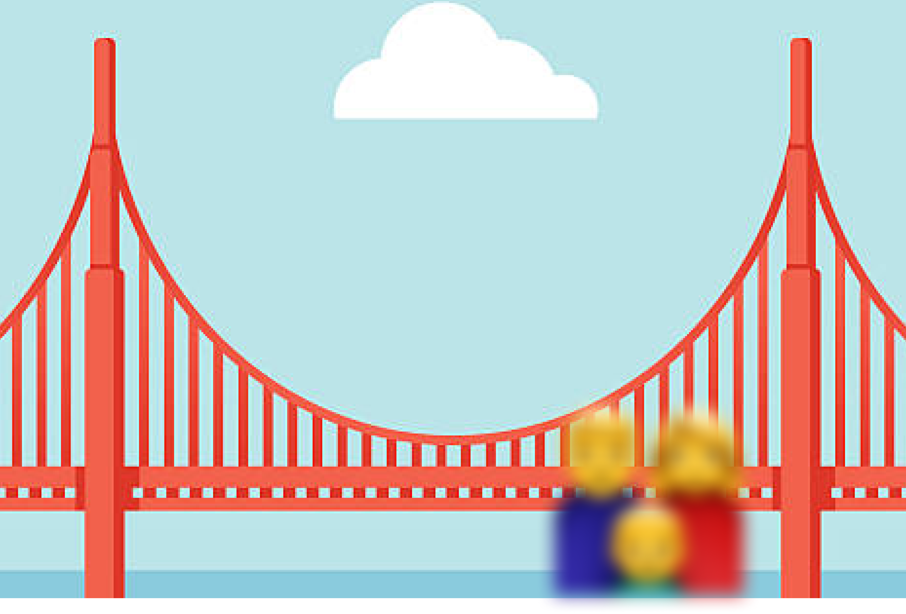

I am terrible at taking photos. But it does not stop me from being “drafted” by others to perform the duty. Usually when this kind of random luck hits me, I will simply go with my “brute force flow” by quickly taking a couple photos and let the people decide which they like.

Last week when I was walking around the Golden Gate Bridge, I was stopped by another family for the same quest. As usual, I took a few shots and handed the camera back to them like the mission was complete. But none of my attempts seem to pan out. You can recognize the wondering face before the approved stamp can be issued.

So I decided to give it one more attempt. Unfortunately, my hand shook a bit while pressing the camera shutter and I screwed it up again. Surprisingly, they liked it this time. I was confused as I can’t even tell what the background view is anymore, which is the only thing that holds my attention by far.

Finally I realized that it’s not how I’m taking the photo is wrong or matters the most, rather what I am focusing at. I’ve been completely blind about what seems obvious. Time to learn more about photography and some other common senses for myself.
