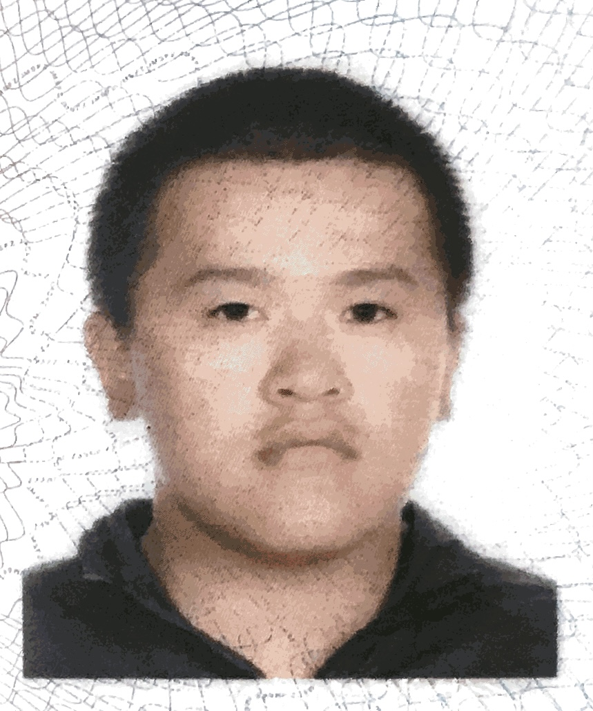
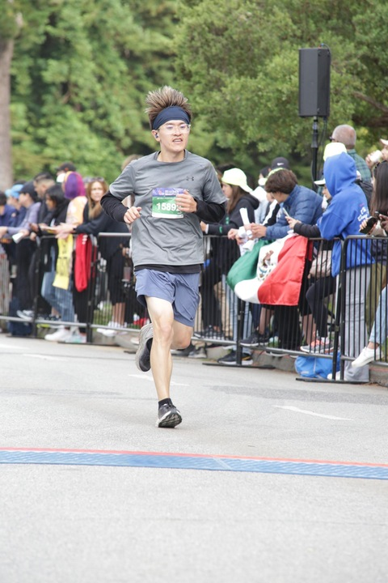

我们从一组照片开始吧。

认识我的人都知道我从小就是个胖子，周围的人都乐此不疲给我起各种各样的外号，我也总是表现出无所谓的态度，可事实果真如此吗？
相信所有人都照过镜子，但如何知道自己照的不是哈哈镜，显微镜，望远镜，滤镜而是一个真实的镜子呢，有个办法是通过别人的镜子看自己。

我第一次有这个浅显的认识得追溯到大学了。那时候我的一个好朋友正在为自己感情问题焦虑，我很不知趣地调侃了他一句，大概意思是说你怎么这么拧巴，看我多潇洒自在。他想都没想直接回怼了我一句，"就你长得那XX样子，确实没啥好焦虑的”。
哇哦，像突然被别人扇了一个大耳光，猝不及防。
我既惊讶又愤怒，更有一点无措，因为这确实很伤人。但情绪过后，我看到了自己过去看不到的一面——**别人诚实的评价**。
仅仅那个学期我就瘦了二十多斤，具体怎么瘦的我早已经不记得了，因为过去太久了，但我身边的人都发现并惊讶于我瘦了。其实我也惊讶，因为我只依稀记得自己的愤怒，其他似乎自然而然就发生了。至少陌生人不再一见面就给你贴标签，也没有了那么多奇奇怪怪的问候。

大家可能觉得一个人只要外在变好了，就一定更自信了。毕竟这不就是问题的根源吗，我们或是身材不够好，或是长得不够好看，或是经济条件不够好。
对此，我不完全认同。
改变外在有很多方法，可以节食，可以锻炼，可以吃药，也可以通过其他医学手段。但是真正的创伤却不在外面，而在心里。**我们需要被治愈，而不是改变别人的看法**。
事实上，别人的看法很难被改变。
至少，这不在我们能控制的范围**。**而内心的改变却必须是一段旅程，虽然有人快一点有人慢一点，但从来没有什么捷径可走。我们听说过很多别人通过某事某人顿悟的故事，但我们从来看不见别人走过的漫长心路历程。

有条件的都可以尝试一些专业的心理咨询，因为心理和身体一样需要“体检“。
说到创伤，很多人都多少有所了解，但我不确定有多少人深刻感受过，社会的主流价值观告诉我们成年人要学会佯装坚强。但真实情况是从小学开始就会有同学嘲笑你，会有同学甚至老师给你起各种各样的外号，甚至就连打特么个球别人都争先恐后要防守”那个小胖子”。
因为惧怕周围人异样的眼光，我很长一段时间走路不敢挺胸抬头，不敢去公共浴室和游泳池，不敢和别人有直接的眼神接触。我妄想可以掩耳盗铃，只要自己掩饰别人就会无视。可是由于缺乏最起码的互相尊重，你会有一种长期内在和外在身份的割裂。
这时候你的心里防御会保护你，对外你会表现得无所谓，表现出一种蔑视和偏激。因为**每个人都渴望也应该被尊重**。可是心里的铠甲穿久了，我们就会和真实的自我脱节，我们会忘记自己的名字。如果我们不想成为千与千寻中的小白龙，我们得**学会面对，给自己时间，接纳自我，和这个世界和解**。

你要知道这一切并不是你自己的错，很多时候我们是环境（家庭、学校、社会…）的产物。别人或者自己所了解的自己只是冰山一角，环境对自己的影响才是藏在水下的冰山。其他人对你造成的伤害很多也不是有意为之，因为我自己也曾经对别人做着同样的事情而不自知。
你不需要用极端的方法证明自己值得被喜欢，不需要刻意去impress别人，不需要尝试一切**矫枉过正**的偏方怪方。你只需要对自己负责，培养能动性（不是学校教的那套，学校培养的是被动性），和健康的生活习惯。**善待自己的身心，你的身心也会善待你**。
道阻且长，行则将至。
🫶
